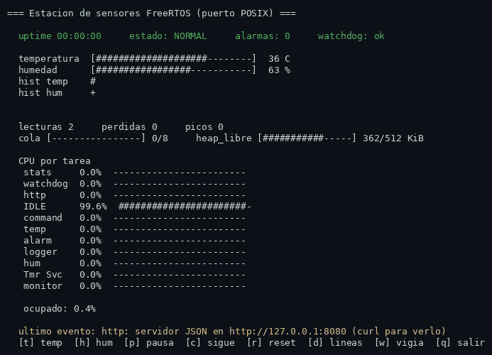
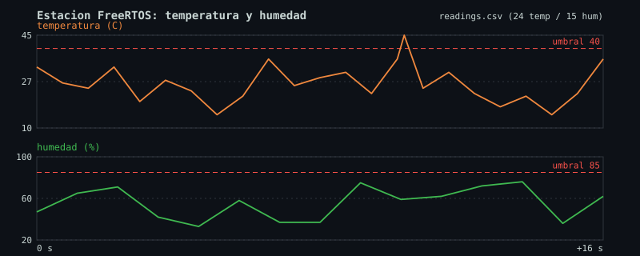

# Sensor station with FreeRTOS

[](https://github.com/Ghostalex07/freertos-sensor-station/actions/workflows/ci.yml)

Educational **FreeRTOS** demo that simulates a temperature and humidity sensor station, running on **Linux** over the `GCC_POSIX` port (FreeRTOS tasks run as `pthread` threads, no board or emulator needed).



## Highlights

- 🐧 **No hardware**: it uses the FreeRTOS `GCC_POSIX` port, so you can try real multitasking on your own PC.
- 📡 **Classic RTOS pipeline**: sensors → queue → monitor → semaphore → alarm task → event group.
- ⏱️ **Guaranteed periodicity** with `vTaskDelayUntil` (no drift accumulates).
- ⌨️ **Interactive interface** over stdin in raw terminal mode: inject spikes, pause sensors, reset counters.
- 🖥️ **Interactive dashboard** in the terminal (key `d`): temperature/humidity/queue/heap bars, **CPU % per task** (`uxTaskGetSystemState` + run-time stats at 1 µs) and **sparklines** with the last 32 readings.
- 📊 **Own telemetry**: free heap, task count, minimum stack, CPU usage every 5 s, ISR events injected by the tick hook and the worst-case reading age (`max_age_ms`).
- 📝 **CSV logging**: the `logger` task writes `readings.csv` (every reading) and `events.csv` (alarms, watchdog, events) through a **stream buffer** and a **message buffer**.
- 🐕 **Software watchdog**: it watches the heartbeat of the 7 tasks; if one exceeds its timeout it reports it as an event (stall it with `w` to see it in action).
- 🌐 **HTTP endpoint**: minimal JSON server on `127.0.0.1:8080/metrics` with state, CPU %, heap, watchdog and latest reading (`curl` to see it).
- 🛑 **Clean shutdown with signals**: `SIGINT`, `SIGTERM` and `SIGHUP` end the demo gracefully (also with stdin closed).
- 🔀 **Stream/message buffers**: binary for readings (stream) and text for events (message buffer), both real FreeRTOS primitives.
- 🧰 **Advanced primitives with an interactive demo**: queue of queues (*queue set*) + `xQueueOverwrite`/`xQueuePeek`, temp+hum synchronization with an event group, priority inversion semaphore vs mutex (key `i`), `vTaskPrioritySet` (key `v`), backpressure with a slow consumer (key `k`), ISR simulation with the FromISR APIs (key `f`), a recoverable AB/BA deadlock (key `y`) and a `vTaskList` dump (key `s`).
- ⏳ **End-to-end latency**: every reading carries its birth tick, so `max_age_ms` measures the worst age from producer to consumer (run the `k` demo and watch it spike).
- 🖼️ **HTML page** at `http://127.0.0.1:8080/` (besides the JSON `/metrics`, now with **CPU % per task**).
- 📜 **CSV rotation**: `readings.csv` rotates to `readings.1.csv` past 64 KiB.
- 🧪 **Unit tests**: pure functions in `src/logic.c` tested with `ctest` (`tests/test_logic.c`).
- ⚙️ **Static allocation**: the `logger` task uses `xTaskCreateStatic` with its own TCB and stack (no `pvPortMalloc`).
- 🎲 **Reproducible seed**: `SENSOR_STATION_SEED=42 ./build/sensor_station` produces deterministic readings (useful in CI).
- 🔧 **Centralized configuration** in `FreeRTOSConfig.h` and in the header of `src/main.c`.
- 🏗️ **CMake build**: downloads the kernel with `FetchContent` or uses a local one with `-DFREERTOS_KERNEL_PATH`.

---

## Requirements

| Requirement | Minimum version |
| --- | --- |
| Operating system | Linux |
| Compiler | `gcc` |
| CMake | 3.15 |

> [!NOTE]
> On the **first configuration**, CMake downloads the FreeRTOS kernel from GitHub with `FetchContent` (FreeRTOS-Kernel **V11.3.1**), so you need network access. If you work **offline**, clone the kernel yourself and pass its path with `-DFREERTOS_KERNEL_PATH=/path/to/FreeRTOS-Kernel`.

---

## Build and run

```bash
cmake -S . -B build
cmake --build build -j
ctest --test-dir build --output-on-failure   # unit tests (optional)
./build/sensor_station
```

### Offline variant (local kernel)

```bash
cmake -S . -B build -DFREERTOS_KERNEL_PATH=/path/to/FreeRTOS-Kernel
cmake --build build -j
./build/sensor_station
```

The executable is produced as `sensor_station` inside `build/`.

---

## Controls

Press the keys while the application is running. If stdout is a **terminal**, the demo starts in *dashboard* mode (full screen with bars); with stdout redirected to a file/pipe it uses line mode. The `d` key toggles between the two.

| Key | Action |
| :---: | --- |
| `t` | Injects an out-of-threshold temperature reading (triggers an alarm) |
| `h` | Injects an out-of-threshold humidity reading (triggers an alarm) |
| `p` | Pauses the sensors (`xSensorsPaused` flag, no `vTaskSuspend`) |
| `c` | Resumes the sensors |
| `r` | Resets the alarm counter |
| `d` | Toggles between dashboard mode and line mode (terminal only) |
| `w` | Watchdog telemetry: stops the `monitor` heartbeats (without suspending it, so it holds no mutex) and shows the "failed to beat" detection and the recovery |
| `i` | **Priority inversion**: the LOW task takes the resource (binary semaphore in the 1st phase, mutex with inheritance in the 2nd phase); the HIGH task waits and its blocking time is printed |
| `v` | **`vTaskPrioritySet`**: drops `monitor` from priority 3 to 1 for 5 s and restores it |
| `k` | **Backpressure**: enables/disables a slow consumer (2 s per reading) and watch `dropped` rise |
| `f` | **ISR simulation**: while enabled, `vApplicationTickHook` (ISR context) injects 1 fake reading/s with `xQueueSendFromISR` + `portYIELD_FROM_ISR` |
| `y` | **Recoverable deadlock**: two tasks take two mutexes AB/BA; the second take has a 1000 ms timeout that breaks the circular wait |
| `s` | **`vTaskList`**: dumps the state of every task to `tasks.txt` (and prints it in line mode) |
| `q` | Exits the application cleanly |
| `?` | Shows the help |

---

## Architecture

### Data flow

```
 ┌────────────────┐   ┌────────────────┐
 │  task temp     │   │  task hum      │      priority 2
 │  (700 ms)      │   │  (1100 ms)     │      vTaskDelayUntil
 └───────┬────────┘   └───────┬────────┘
         │  xQueueSend        │  xQueueSend
         └──────────┬─────────┘
                    ▼
        ┌───────────────────────┐
        │   queue (8 entries)   │
        └───────────┬───────────┘
                    │  xQueueReceive (blocking)
                    ▼
        ┌───────────────────────┐
        │   task monitor        │  priority 3
        │  prints readings      │
        │  detects alarms       │
        └───────────┬───────────┘
                    │  xSemaphoreGive  (alarm?)
                    ▼
        ┌───────────────────────┐
        │   task alarm          │  priority 4 (highest)
        │  xSemaphoreTake       │
        │  counter + mutex      │
        │  prints the alarm     │
        └───────────┬───────────┘
                    │  xEventGroupSetBits
                    ▼
        ┌───────────────────────┐
        │     event group       │   active alarm bit
        │  (cleared after 3 s)  │
        └───────────────────────┘

  ── Independent ────────────────────────────────────────────
  ┌────────────────┐        ┌──────────────────────────────┐
  │  task stats    │        │  software timer (10 s)       │
  │  priority 1    │        │  xTimerCreate                │
  │  every 5 s     │        │  injects temperature spikes  │
  │  (or 500 ms    │        └──────────────────────────────┘
  │   dashboard)   │        CPU% per task: uxTaskGetSystemState
  └────────────────┘
  ┌────────────────┐  ┌────────────────┐  ┌────────────────┐
  │  logger (CSV)  │  │  watchdog      │  │  http (8080)   │
  │  stream+msgbuf │  │  beat x7       │  │  JSON metrics  │
  └────────────────┘  └────────────────┘  └────────────────┘
```

### FreeRTOS primitives used

| Primitive | APIs | Role in the demo |
| --- | --- | --- |
| **Queue** | `xQueueCreate`, `xQueueSend`, `xQueueReceive` | Carries the sensor readings to the monitor (8 slots). |
| **Mutex** | `xSemaphoreCreateMutex`, `xSemaphoreTake`, `xSemaphoreGive` | One protects the shared `printf` output, the other the alarm counter. |
| **Binary semaphore** | `xSemaphoreCreateBinary`, `xSemaphoreTake`, `xSemaphoreGive` | The monitor signals the alarm task when it detects a threshold breach. |
| **Event group** | `xEventGroupCreate`, `xEventGroupSetBits`, `xEventGroupClearBits` | Marks an active alarm and clears it after 3 s. |
| **Counting semaphore** | `xSemaphoreCreateCounting` | Counts the dropped readings when the queue is full; `stats` consumes them. |
| **Task notification** | `xTaskNotifyGive`, `xTaskNotifyWait` | Wakes the `stats` task instantly to redraw the dashboard. |
| **Software timer** | `xTimerCreate` | Every 10 s it injects a temperature spike that triggers an alarm. |
| **Task management** | `xTaskCreate`, `xTaskCreateStatic`, `xSensorsPaused` flag | Creates the 15 tasks (one of them statically allocated); `p`/`c` pause the sensors with a flag (no task is blocked). |
| **Periodicity** | `vTaskDelayUntil` | The sensors run every 700 ms / 1100 ms without drift. |
| **Diagnostics** | `xPortGetFreeHeapSize`, `uxTaskGetStackHighWaterMark`, `uxTaskGetSystemState` | The `stats` task reports heap, minimum stack and CPU % per task (*run-time stats*). |
| **Stream buffer** | `xStreamBufferCreate`, `xStreamBufferSend`, `xStreamBufferReceive` | Binary sensor→logger readings; the monitor sends every sample and `logger` dumps `readings.csv`. |
| **Message buffer** | `xMessageBufferCreate`, `xMessageBufferSend`, `xMessageBufferReceive` | Event text (alarms, watchdog, http…) into `events.csv`. |
| **Queue set** | `xQueueCreateSet`, `xQueueAddToSet`, `xQueueSelectFromSet` | The set collects the "latest value" queues of temp and hum; `aggreg` waits on the queue set and resolves with `xQueuePeek`. |
| **`xQueueOverwrite`** | `xQueueOverwrite` | Length-1 queues holding the most recent value of each sensor ("latest value" pattern, no sample lost). |
| **`xQueuePeek`** | `xQueuePeek` | `aggreg` reads the latest value **without consuming it**, so it can average both series. |
| **Synchronization (event group)** | `xEventGroupWaitBits` (wait for all bits) | `sync` only prints when temp **and** hum arrive from the same cycle (separate bits, wait with `xWaitForAllBits`). |
| **Priority inversion** | binary semaphore vs `xSemaphoreCreateMutex` | Demo `i`: the LOW task holds the resource while the HIGH task waits; the mutex applies inheritance and cuts the wait from ~1 s to <10 ms. |
| **`vTaskPrioritySet`** | `vTaskPrioritySet` | Demo `v`: lowers and restores the `monitor` priority on the fly. |
| **Backpressure** | blocking consumer + `xSemaphoreGive` (counting) | Demo `k`: with the queue full, the drops grow and are counted in `dropped`. |
| **Static allocation** | `xTaskCreateStatic` | The `logger` task uses a static TCB and stack (no `pvPortMalloc`). |
| **`vTaskList`** | `vTaskList` (trace facility) | Demo `s`: dumps name/state/priority/stack of every task to `tasks.txt`. |
| **ISR context** | `vApplicationTickHook`, `xQueueSendFromISR`, `portYIELD_FROM_ISR` | Demo `f`: the tick interrupt injects a fake reading every second; in ISR context only the FromISR API family is legal. |
| **Bounded wait** | `xSemaphoreTake` with timeout | Demo `y`: the AB/BA circular wait is broken by the 1000 ms timeout on the second take (the escape hatch from deadlock). |
| **POSIX sockets** | `socket`, `accept`, `send` | The `http` task exposes `127.0.0.1:8080` (JSON and HTML) outside the kernel, LWIP-style. |

---

## Observability

### CSV (`logger`)

| File | Content |
| --- | --- |
| `readings.csv` | `epoch_ms,sensor,value,sequence,alarm` — every reading that passes through the monitor. |
| `events.csv` | `epoch_ms,event` — alarms, watchdog, HTTP events, startup and shutdown. |

Past **64 KiB**, `readings.csv` rotates to `readings.1.csv` and reopens with a header. To plot it with no dependencies:

```bash
python3 tools/plot_csv.py readings.csv docs/chart.svg   # generates the time series
```



### HTTP (`http`)

```bash
curl http://127.0.0.1:8080/metrics
# {"uptime_s":2,"state":"normal","alarms":0,...,"cpu_pct":{"temp":0.4,...},...}

curl http://127.0.0.1:8080/          # HTML page auto-refreshing every 2 s
```

The JSON now includes **`cpu_pct` with the CPU usage (%) of temp, hum, monitor and alarm**, plus **`isr_events`** (readings injected from the tick hook) and **`max_age_ms`** (worst-case end-to-end reading age). The connection closes itself after the response (no `keep-alive`) and uses `MSG_DONTWAIT` so it never blocks the scheduler.

### Watchdog

Every task beats with `vWatchdogBeat()`; the `watchdog` task compares against its own timeouts (5 s, 8 s for `stats`). Press `w` to stop the `monitor` heartbeats (internal flag, never `vTaskSuspend`: suspending it with mutexes held would hang the system) and see the `failed to beat` event plus `beat resumed`.

### Reproducible seed

```bash
SENSOR_STATION_SEED=42 ./build/sensor_station   # identical readings on every run
```

---

## Configuration

Everything tunable lives in two places:

| What | Where | Detail |
| --- | --- | --- |
| Alarm thresholds | `src/main.c` | Constants `TEMP_ALARM_THRESHOLD` and `HUM_ALARM_THRESHOLD` at the top of the file. |
| Sensor period | `src/main.c` | The `xTempSensor` and `xHumSensor` tasks (700 ms and 1100 ms). |
| Heap size | `FreeRTOSConfig.h` | `configTOTAL_HEAP_SIZE = 524288` (512 KiB). |
| Minimum stack size | `FreeRTOSConfig.h` | `configMINIMAL_STACK_SIZE = 2048`. |
| Tick frequency | `FreeRTOSConfig.h` | 100 Hz (10 ms per tick). |
| Stack overflow detection | `FreeRTOSConfig.h` | `configCHECK_FOR_STACK_OVERFLOW = 2`. ⚠️ On the GCC_POSIX port every task runs in a pthread with a native stack: the FreeRTOS stack mark is constant, the real protection comes from the system itself. |
| CPU % per task | `FreeRTOSConfig.h` | `configGENERATE_RUN_TIME_STATS = 1` with its own 1 µs counter (`portALT_GET_RUN_TIME_COUNTER_VALUE`, see `ulPortGetAltMicros()` in `src/main.c`). |

> The task periods, the event group clearing window (3 s) and the timer period (10 s) are also defined in `src/main.c`.

---

## Proposed exercises

Ordered from easy to hard:

1. **Change the thresholds.** Modify `TEMP_ALARM_THRESHOLD` and `HUM_ALARM_THRESHOLD` and check that alarms fire earlier or later. What happens if you raise the threshold above the maximum value the random sensor can produce?

2. **Backpressure on the queue.** Change the sensors' `xQueueSend` to use `portMAX_DELAY` instead of a short timeout, and slow down the `monitor` task (increase its delay or give it more work). Watch how the producers block when the queue (8 entries) fills up. *Already implemented as a demo: press `k`.*

3. **Add a third sensor.** Copy the `temp`/`hum` pattern to create a pressure sensor with its own period, add the corresponding field to the queue format and extend `monitor` to print it and evaluate its threshold.

4. **Silent mode.** Make the `alarm` task, while it rings (for those 3 s), suspend the `stats` task with `vTaskSuspend` and resume it when the event group bit is cleared. Check that no statistics are printed while an alarm is active.

5. **Play with priorities.** Raise and lower the priorities of `monitor`, `alarm` and `stats` and watch how the output order changes when several tasks are ready at the same time. Explain the result in terms of FreeRTOS preemptive scheduling. *An example with `vTaskPrioritySet` is already there: press `v`; the priority inversion is on `i`.*

---

## Repository structure

```
freertos-sensor-station/
├── .github/workflows/ci.yml  # CI: local build + FetchContent + ASan, ctest and smoke test
├── CMakeLists.txt        # Build: FetchContent of the kernel or local path + logic_tests
├── FreeRTOSConfig.h      # FreeRTOS configuration (heap, stack, tick, queue sets…)
├── LICENSE               # MIT
├── README.md             # This file
├── .gitignore
├── src/
│   ├── app_config.h          # App constants: periods, thresholds, CSV paths, priorities
│   ├── app_types.h           # Shared types: sensors, CSV record, global state, watchdog ids
│   ├── app_shared.h          # Seam between modules: `extern` globals and common utilities
│   ├── logic.c / logic.h     # Pure functions (sparklines, bars, thresholds) with tests
│   ├── main.c                # Orchestrator: sensors, monitor, alarms, stats, sync, init and main()
│   ├── watchdog.c / watchdog.h    # Per-task heartbeats and periodic review (vWatchdogBeat)
│   ├── logger_csv.c / logger_csv.h # Writing and rotating readings.csv and events.csv
│   ├── http_server.c / http_server.h # HTTP server: HTML dashboard and JSON metrics
│   ├── dashboard.c / dashboard.h  # ANSI dashboard rendering (bars, sparklines, CPU per task)
│   └── demos.c / demos.h     # Keyboard (vCommandTask) and demos: inversion, priorities, watchdog, backpressure
├── tests/test_logic.c    # Unit tests (ctest)
├── tools/plot_csv.py     # SVG chart of readings.csv with no dependencies
└── docs/
    ├── demo.gif          # Recording of the running dashboard
    └── chart.svg         # Time series generated by tools/plot_csv.py
```

---

## License

This project is distributed under the **MIT** license. See the [`LICENSE`](LICENSE) file.
